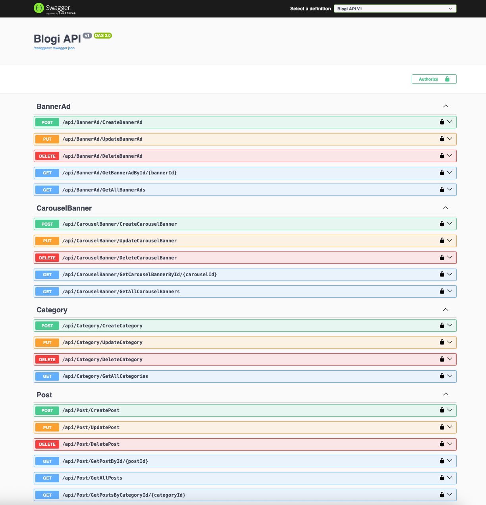
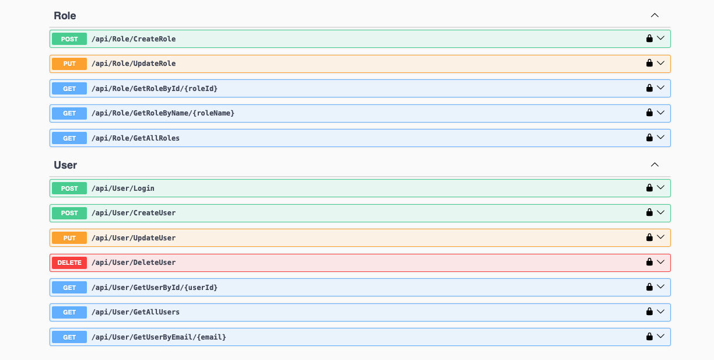
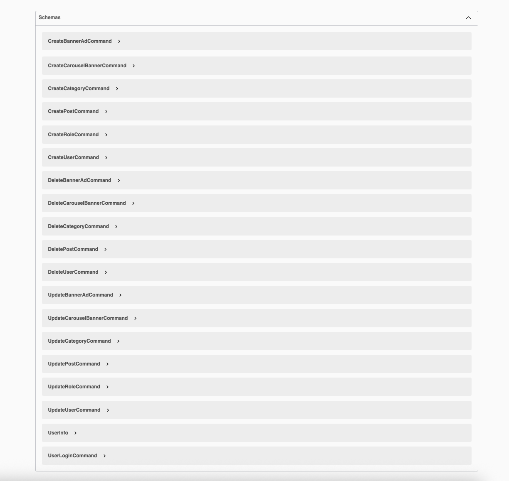

# BlogiAPI

**BloggiAPI** is a web API for managing a blogging platform, built using **.NET 9.0** and the **Chain of Responsibility** design pattern for modular and maintainable request handling. This API provides endpoints for user management, roles, categories, posts, banner ads, and carousel banners, with a PostgreSQL backend and Dapper for data access.

## Table of Contents
- [Features](#features)
- [Technologies](#technologies)
- [Architecture](#architecture)
- [Setup Instructions](#setup-instructions)
- [Database Schema](#database-schema)
- [API Endpoints](#api-endpoints)
- [Screenshots](#screenshots)
- [Contributing](#contributing)
- [License](#license)

## Features
- **User Management**: Create, update, delete, and authenticate users with role-based access.
- **Role Management**: Manage user roles with create and update capabilities.
- **Categories**: Organize posts into categories with CRUD operations.
- **Posts**: Create, update, delete, and retrieve blog posts, including filtering by category.
- **Banner Ads**: Manage banner advertisements with scheduling and activation status.
- **Carousel Banners**: Handle carousel banners with display order and activation.
- **Authentication**: JWT-based authentication for secure endpoint access.
- **Scalable Design**: Modular architecture using the Chain of Responsibility pattern.

## Technologies
- **.NET 9.0**: Latest .NET framework for high performance and modern features.
- **ASP.NET Core**: Web API framework for building RESTful services.
- **PostgreSQL**: Relational database for data persistence.
- **Dapper**: Lightweight ORM for efficient database operations.
- **Npgsql**: PostgreSQL provider for .NET.
- **Chain of Responsibility**: Design pattern for handling requests through a chain of handlers.
- **Dependency Injection**: Built-in .NET DI for service management.
- **Swagger**: API documentation and testing interface.

## Architecture
BlogiAPI uses the **Chain of Responsibility** pattern to process requests through a series of handlers, ensuring modularity and extensibility. The architecture is layered as follows:
- **Controllers**: Handle HTTP requests and responses, delegating to orchestrators.
- **Orchestrators**: Coordinate business logic, chaining handlers for commands (create, update, delete) and queries (get).
- **Handlers**: Process specific commands or queries, leveraging services.
- **Services**: Implement business logic, split into command services (write operations) and query services (read operations).
- **Repositories**: Encapsulate data access using Dapper, interacting with PostgreSQL stored procedures.
- **Database**: PostgreSQL with stored procedures for CRUD operations.

The flow for a request (e.g., creating a user):
1. HTTP request hits the `UserController`.
2. `UserOrchestrator` chains an `AuthorizationHandler` and `CreateUserHandler`.
3. `CreateUserHandler` calls `UserCommandServices`.
4. `UserCommandServices` uses `SqlCommandFactory` to generate a stored procedure call.
5. `BaseRepository` executes the procedure via Dapper.

## Setup Instructions
### Prerequisites
- **.NET 9.0 SDK**: Install from [Microsoft](https://dotnet.microsoft.com/download/dotnet/9.0).
- **PostgreSQL**: Version 13 or later, with `psql` or a GUI like pgAdmin.
- **Git**: For cloning the repository.
- **IDE**: Visual Studio 2022, Rider, or VS Code.

### Installation
1. **Clone the Repository**:

2. **Configure the Database**:
    - Create a PostgreSQL database:
      ```sql
      CREATE DATABASE bloggiapi;
      ```
    - Apply the schema and stored procedures from `BlogiAPI/BlogiAPI/Documentation/Blogi_DB_updated.sql` :
      ```bash
      psql -U postgres -d bloggiapi -f BlogiAPI/BlogiAPI/Documentation/Blogi_DB_updated.sql
      ```

3. **Update Configuration**:
    - Edit `appsettings.json` with your PostgreSQL connection string:
      ```json
      {
        "ConnectionStrings": {
          "DefaultConnection": "Host=localhost;Database=bloggiapi;Username=postgres;Password=yourpassword"
        }
      }
      ```

4. **Restore Dependencies**:
   ```bash
   dotnet restore
   ```

5. **Build and Run**:
   ```bash
   dotnet build
   dotnet run --project BlogiAPI/BlogiAPI
   ```

6. **Access the API**:
    - Open `https://localhost:5001/swagger` (or configured port) for the Swagger UI.
    - You can also use Postman or curl to test endpoints.

## Database Schema
The database consists of the following tables, managed via stored procedures:
- **users**: Stores user details (ID, firstname, lastname, email, password_hash, address, role_id, created_at, updated_at).
- **roles**: Defines roles (ID, name, created_at).
- **categories**: Organizes posts (ID, name, description, created_at).
- **posts**: Stores blog posts (ID, title, content, image_url, category_id, author_id, created_at, updated_at, is_published).
- **banner_ads**: Manages advertisements (ID, title, image_url, redirect_url, start_date, end_date, is_active, created_at).
- **carousel_banners**: Handles carousel displays (ID, title, image_url, description, display_order, redirect_url, is_active, created_at).

Stored procedures (e.g., `create_user`, `get_all_posts`) handle CRUD operations, defined in the database schema file.

## API Endpoints
Below is a summary of the main endpoints. All endpoints except `/Login` require JWT authentication.

| Method | Endpoint                              | Description                              |
|--------|---------------------------------------|------------------------------------------|
| POST   | `/Login`                              | Authenticates a user, returns JWT token. |
| POST   | `/CreateUser`                         | Creates a new user.                      |
| PUT    | `/UpdateUser`                         | Updates an existing user.                |
| DELETE | `/DeleteUser`                         | Deletes a user.                          |
| GET    | `/GetUserById/{userId}`               | Retrieves a user by ID.                  |
| GET    | `/GetUserByEmail/{email}`             | Retrieves a user by email.               |
| GET    | `/GetAllUsers`                        | Retrieves all users.                     |
| POST   | `/CreateRole`                         | Creates a new role.                      |
| PUT    | `/UpdateRole`                         | Updates an existing role.                |
| GET    | `/GetRoleById/{roleId}`               | Retrieves a role by ID.                  |
| GET    | `/GetRoleByName/{roleName}`           | Retrieves a role by name.                |
| GET    | `/GetAllRoles`                        | Retrieves all roles.                     |
| POST   | `/CreateCategory`                     | Creates a new category.                  |
| PUT    | `/UpdateCategory`                     | Updates an existing category.            |
| DELETE | `/DeleteCategory`                     | Deletes a category.                      |
| GET    | `/GetCategoryById/{categoryId}`       | Retrieves a category by ID.              |
| GET    | `/GetAllCategories`                   | Retrieves all categories.                |
| POST   | `/CreatePost`                         | Creates a new post.                      |
| PUT    | `/UpdatePost`                         | Updates an existing post.                |
| DELETE | `/DeletePost`                         | Deletes a post.                          |
| GET    | `/GetPostById/{postId}`               | Retrieves a post by ID.                  |
| GET    | `/GetPostsByCategoryId/{categoryId}`  | Retrieves posts by category ID.          |
| GET    | `/GetAllPosts`                        | Retrieves all posts.                     |
| POST   | `/CreateBannerAd`                     | Creates a new banner ad.                 |
| PUT    | `/UpdateBannerAd`                     | Updates an existing banner ad.           |
| DELETE | `/DeleteBannerAd`                     | Deletes a banner ad.                     |
| GET    | `/GetBannerAdById/{bannerId}`         | Retrieves a banner ad by ID.             |
| GET    | `/GetAllBannerAds`                    | Retrieves all banner ads.                |
| POST   | `/CreateCarouselBanner`               | Creates a new carousel banner.           |
| PUT    | `/UpdateCarouselBanner`               | Updates an existing carousel banner.     |
| DELETE | `/DeleteCarouselBanner`               | Deletes a carousel banner.               |
| GET    | `/GetCarouselBannerById/{carouselId}` | Retrieves a carousel banner by ID.       |
| GET    | `/GetAllCarouselBanners`              | Retrieves all carousel banners.          |

Detailed endpoint documentation is available in the Swagger UI.

## Screenshots

### Endpoints Screenshot 1


### Endpoints Screenshot 2


### Schemas


## Contributing
Contributions are welcome! To contribute:
1. Fork the repository.
2. Create a feature branch (`git checkout -b feature/describe-feature`).
3. Commit your changes (`git commit -m "features"`).
4. Push to the branch (`git push origin feature/describe_feature`).
5. Open a pull request.

Please include tests and follow the coding style in the project.

## License
This project is licensed under the MIT License. 

